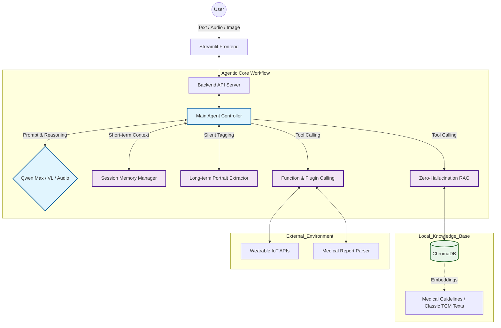

# 🏥 YueYang - Medical-Grade Multi-Agent Health Advisory System

[English](./README.en.md) | [中文简体](./README.md)

> 🏆 **2025 Alibaba Large Model Application Top Competition · National Finalist**
> 👑 **Hangzhou AI Workshop Exclusive Invited Personal Project**
> 
> **YueYang** is a highly autonomous personal health advisory Agent. It integrates Chinese and Western medicine dual-mode reasoning logic, featuring full-modality data perception, long/short-term dual-state memory networks, and a zero-hallucination RAG retrieval engine, aiming to provide safe, precise, and personalized health intervention plans.

<div align="center">

[](https://www.python.org/)
[](https://streamlit.io/)
[](https://help.aliyun.com/zh/dashscope/)
[](https://www.trychroma.com/)
[](LICENSE)

</div>

---

## 🧠 System Architecture



---

## 📈 Project Evolution

This project has completed a deep refactoring from "business logic validation" to "fully autonomous underlying infrastructure":

* **Phase 1: Business Loop & Model Validation (V1.0)**
    * Rapidly verified the feasibility of "integrated Chinese and Western medicine intervention" and "multi-modal health records" based on the Alibaba Bailian platform, successfully earning a spot in the national finals.
* **Phase 2: Native Core Refactoring (V2.0 Native Core) 👈 `Current Status`**
    * To break through black-box limitations and performance bottlenecks, **the Agentic Workflow was rebuilt entirely using native Python**.
    * Autonomously implemented underlying Function Calling protocols, a local medical RAG system based on ChromaDB, and multi-tenant isolated memory streams.

---

## 🚀 Technical Highlights

### 1. End-to-End Multi-modality Perception
* **Unstructured Medical Report Parsing:** Natively integrates `Qwen-VL` to achieve precise JSON formatting and extraction from complex medical checkup reports (PDF/Images), discarding fragile OCR pipelines.
* **Audio Direct-to-Memory Architecture:** Bypasses traditional ASR, routing audio pulses directly to the multi-modal LLM to significantly reduce interaction latency.

### 2. Zero-Hallucination Medical RAG
* **Authoritative Local Knowledge Base:** Powered by ChromaDB, slicing and indexing highly authoritative medical literature specifically for high-risk medical Q&A scenarios.
* **Mandatory Traceability Routing:** Forces the LLM to perform vector retrieval before outputting medical diagnostic bases, ensuring 100% traceability of intervention plans.

### 3. Dual-State Memory Network
* **Short-term Session Isolation:** Achieves precise session state isolation and context time-travel in multi-tenant concurrent environments.
* **Long-term Silent Extraction:** Deploys a "Silent Observer" daemon to automatically detect and extract high-value entity tags (allergies, sleep patterns, chronic diseases) across multiple unstructured conversational turns, persistently building dynamic, personalized health profiles.

### 4. Standardized IoT Integration
* Defines data contracts based on strict JSON Schemas, simulating the integration of external smart wearable device APIs (e.g., Huawei Health, Apple Health), granting the LLM the ability to perceive real-world vital signs.

---

## 📸 Showcase

| **Deep Report Parsing** | **Wearable Data Structuring** |
| :---: | :---: |
|  |  |
| *Extracting key abnormal indicators automatically using vision models* | *Agent autonomously aligns hardware vital sign data* |

<br>

<details>
  <summary><b>👉 Click to expand: 6D Intervention Plan (Complete Case)</b></summary>
  <br>
  <div align="center">
    
    <p><em>Outputting comprehensive plans combining Western red-line warnings and TCM constitution adjustments based on local RAG</em></p>
  </div>
</details>

---

## 🛠️ Quick Start

### Prerequisites
* Python >= 3.10
* Valid Qwen API Key (with access to text, VL, and Audio models)

### Installation
```bash
# 1. Clone the repository
git clone [https://github.com/TOB-L/YueYang-Agent.git](https://github.com/TOB-L/YueYang-Agent.git)
cd YueYang-Agent

# 2. Install dependencies
pip install -r requirements.txt

# 3. Environment configuration (create a .env file in the root directory)
echo 'QWEN_API_KEY="sk-your-api-key-here"' > .env

# 4. Initialize the local medical knowledge base (ChromaDB)
python yueyang/rag/build_knowledge.py

# 5. Start the service
# Start backend API (if applicable)
python server.py
# Start frontend UI
streamlit run app.py
```

---

## ⚠️ Safety & Compliance

This project strictly adheres to medical and personal data protection regulations at the algorithmic level.

> **Disclaimer:** All intervention plans and data analysis output by the system are for personal health management reference only and **can never replace a face-to-face diagnosis by a licensed professional physician**.

**🚨 Algorithmic Kill-Switch:**
The system features a built-in high-risk symptom detector. When extreme abnormal combinations are detected (e.g., `HRV sudden drop` + `chest tightness`), the Agent forcibly suspends the standard session, directly triggers a `[🚨 RED ALERT]` interruption, and prominently prompts the user to call emergency services (120/911) immediately.

---

<div align="center">
  <i>Built with ❤️ by Renxin Zhihu Team & Zhang Shuai</i>
</div>