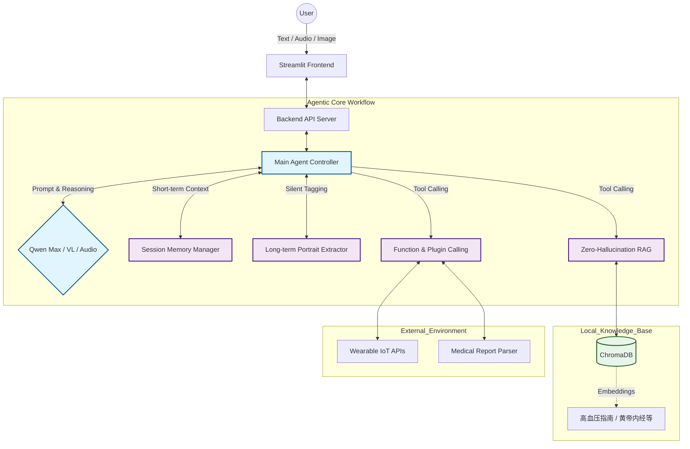

# 🏥 YueYang (悦养) - Medical-Grade Multi-Agent Health Advisory System

> 🏆 **2025 阿里巴巴大模型应用顶尖赛事 · 全国决赛入围项目**
> 👑 **杭州 AI 工坊唯一受邀路演个人项目**
> 
> **YueYang (悦养)** 是一个具有高度自主性的私人健康顾问 Agent。它融合了中西医双模推理逻辑，具备全模态数据感知、长短期双态记忆网络以及零幻觉 RAG 检索引擎，旨在提供安全、精准、个性化的健康干预方案。

<div align="center">

[](https://www.python.org/)
[](https://streamlit.io/)
[](https://help.aliyun.com/zh/dashscope/)
[](https://www.trychroma.com/)
[](LICENSE)

</div>

---

## 🧠 系统核心架构 (System Architecture)



---

## 📈 架构演进 (Project Evolution)

本项目已完成从“商业逻辑验证”到“底层基座完全自主可控”的深度重构：

* **Phase 1: 业务闭环与模型验证 (V1.0)**
    * 依托阿里百炼平台，快速验证“中西医融合干预”与“多模态健康档案”的场景可行性，并成功斩获顶尖赛事全国决赛资格。
* **Phase 2: 底层基座原生重构 (V2.0 Native Core) 👈 `Current Status`**
    * 为突破黑盒限制与性能瓶颈，**采用纯原生 Python 重新构建 Agentic Workflow**。
    * 自主实现底层 Function Calling 通信协议、基于 ChromaDB 的本地医学 RAG 系统，以及多租户隔离的长短期记忆流。

---

## 🚀 核心技术特性 (Technical Highlights)

### 1. 全模态原生感知引擎 (End-to-End Multi-modality)
* **非结构化医学报告解析:** 弃用传统的脆弱 OCR 管线，原生集成 `Qwen-VL`，实现复杂体检报告（PDF/医学影像）的精准 JSON 格式化提取。
* **音频内存直驱架构:** 构建“音频 Base64 内存直驱”策略，语音脉冲跳过常规 ASR 中转，直达多模态音频大模型，显著降低交互延迟。

### 2. 医疗级高保真 RAG 架构 (Zero-Hallucination RAG)
* **权威本地知识库:** 针对医疗高危问答场景，依托 ChromaDB 构建本地向量库，切片索引《中国高血压防治指南》及《黄帝内经》等权威医学文献。
* **强制溯源机制:** 重写 Tool Calling 路由逻辑，强制大模型在输出医疗诊断依据前执行“向量开卷检索”，确保干预方案的 100% 可溯源。

### 3. 长短期双态记忆网络 (Dual-State Memory Network)
* **会话级切片隔离 (Short-term):** 实现多租户并发环境下的会话状态精准隔离与上下文时空穿梭。
* **静默画像提取 (Long-term):** 部署“静默观察者 (Silent Observer)”守护进程，在多轮非结构化对话中自动侦测并提取“过敏史、作息规律、慢性病史”等高价值实体 Tag，持久化构建千人千面的动态健康画像。

### 4. 标准化 IoT 设备泛化接入 (Standardized IoT Integration)
* 基于严谨的 JSON Schema 定义数据契约，模拟挂载外部智能穿戴设备（如华为健康、Apple Health）API，赋予大模型感知物理世界真实体征数据的能力。

---

## 📸 系统能力展示 (Showcase)

| **体检报告深度解析** | **可穿戴设备数据结构化** |
| :---: | :---: |
|  |  |
| *调用多模态视觉模型，自动提取关键异常指标* | *Agent 自主提取并对齐硬件体征数据* |

<br>

<details>
  <summary><b>👉 点击展开查看：融合中西医的六维干预方案输出 (完整案例)</b></summary>
  <br>
  <div align="center">
    
    <p><em>基于本地 RAG，输出西医红线预警与中医体质调理的综合方案</em></p>
  </div>
</details>

---

## 🛠️ 快速上手 (Quick Start)

### 环境要求
* Python >= 3.10
* 有效的通义千问 API 密钥 (包含文本、VL、Audio 模型权限)

### 安装部署
```bash
# 1. 克隆项目
git clone [https://github.com/TOB-L/YueYang-Agent.git](https://github.com/TOB-L/YueYang-Agent.git)
cd YueYang-Agent

# 2. 安装核心依赖
pip install -r requirements.txt

# 3. 环境变量配置 (请在根目录创建 .env 文件)
echo 'QWEN_API_KEY="sk-your-api-key-here"' > .env

# 4. 初始化本地医学知识库 (ChromaDB)
python yueyang/rag/build_knowledge.py

# 5. 启动服务
# 启动后端 API (如果适用)
python server.py
# 启动前端交互 UI
streamlit run app.py
```

---

## ⚠️ 医疗合规与熔断机制 (Safety & Compliance)

本项目在算法底层严格遵循《互联网诊疗监管细则》与《个人信息保护法》。
> **免责声明：** 系统输出的所有干预方案与数据分析仅供个人健康管理参考，**绝不可替代专业执业医师的当面诊断**。

**🚨 算法级熔断底线：**
系统内置了高危体征侦测器。当监测到极端异常组合（例如：`心率变异性(HRV)骤降` + `主诉胸闷/大汗`），Agent 将强制挂起当前普通会话，直接触发 `[🚨 红色高风险]` 中断警报，并醒目提示用户立即拨打急救电话 (120)。

---

<div align="center">
  <i>Built with ❤️ by 仁心智护队 & 张帅</i>
</div>